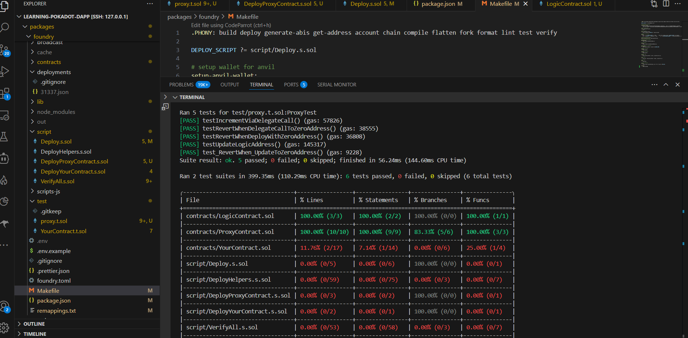
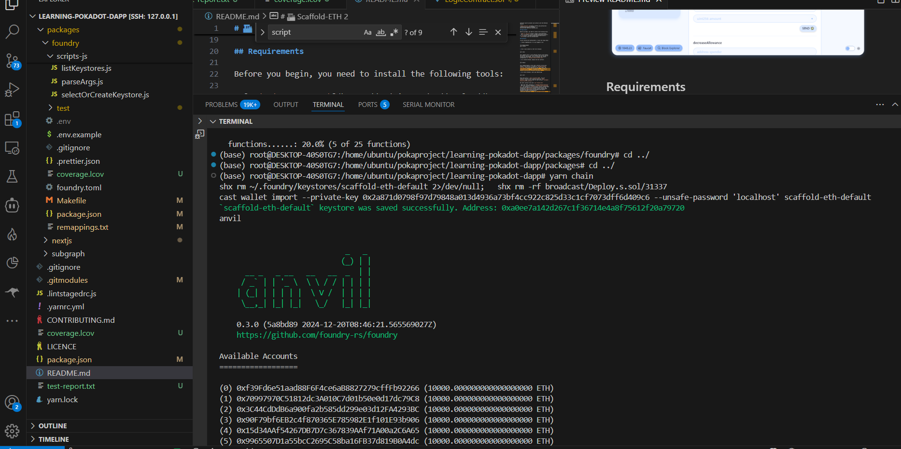

### 1.使用Scaffold-ETH DApp脚手架框架搭建
#### 创建并初始化项目
npx create-eth@latest -e subgraph
通过yarn把forge anvil，anvil，node等命令做了封装
#### 测试!
[测试结果.png](pictures/测试结果.png)

#### 查询测试覆盖率

#### 运行测试并生成测试覆盖率报告
yarn coverage  > test-report.
[test-report.txt](pictures/test-report.txt)

#### 生成详细的HTML 测试覆盖率报告
##### 1.生成 LCOV 文件
yarn coverage --report lcov --report-file coverage.lcov
[coverage.lcov](pictures/coverage.lcov)
##### 2：将 LCOV 文件转换为 HTML 报告
genhtml   coverage.lcov   --output-directory coverage-report


#### 本地部署以及测试
##### 在第一个端口 运行本地网络:
yarn chain

##### 在第二个端口部署测试合约：
yarn deploy
```bash
(base) root@DESKTOP-40S0TG7:/home/ubuntu/pokaproject/learning-pokadot-dapp# yarn deploy
[⠰] Compiling...
No files changed, compilation skipped
Script ran successfully.

## Setting up 1 EVM.

==========================

Chain 31337

Estimated gas price: 2 gwei

Estimated total gas used for script: 1819058

Estimated amount required: 0.003638116 ETH

==========================

##### anvil-hardhat
✅  [Success] Hash: 0x7cae355a42f4c1e2840f53272cbc79d28286cd2bc274b4d26c191b22d88d4ceb
Contract Address: 0xb19b36b1456E65E3A6D514D3F715f204BD59f431
Block: 2
Paid: 0.000798836 ETH (399418 gas * 2 gwei)


##### anvil-hardhat
✅  [Success] Hash: 0xc5e56434e82e48c84515520c6a92d30a99b8c976015f3f51b3f0a7306822e88e
Contract Address: 0x700b6A60ce7EaaEA56F065753d8dcB9653dbAD35
Block: 1
Paid: 0.001743912 ETH (871956 gas * 2 gwei)


##### anvil-hardhat
✅  [Success] Hash: 0x68fc74fe040e937abb65c12b5fa0a4e032827142e579975e793083df26cdcd8d
Contract Address: 0xA15BB66138824a1c7167f5E85b957d04Dd34E468
Block: 2
Paid: 0.000255806 ETH (127903 gas * 2 gwei)

✅ Sequence #1 on anvil-hardhat | Total Paid: 0.002798554 ETH (1399277 gas * avg 2 gwei)


==========================

ONCHAIN EXECUTION COMPLETE & SUCCESSFUL.

Transactions saved to: /home/ubuntu/pokaproject/learning-pokadot-dapp/packages/foundry/broadcast/Deploy.s.sol/31337/run-latest.json

Sensitive values saved to: /home/ubuntu/pokaproject/learning-pokadot-dapp/packages/foundry/cache/Deploy.s.sol/31337/run-latest.json

node scripts-js/generateTsAbis.js
📝 Updated TypeScript contract definition file on ../nextjs/contracts/deployedContracts.ts
```

#### 如何通过fork在外部网络部署合约？
还在探索中。