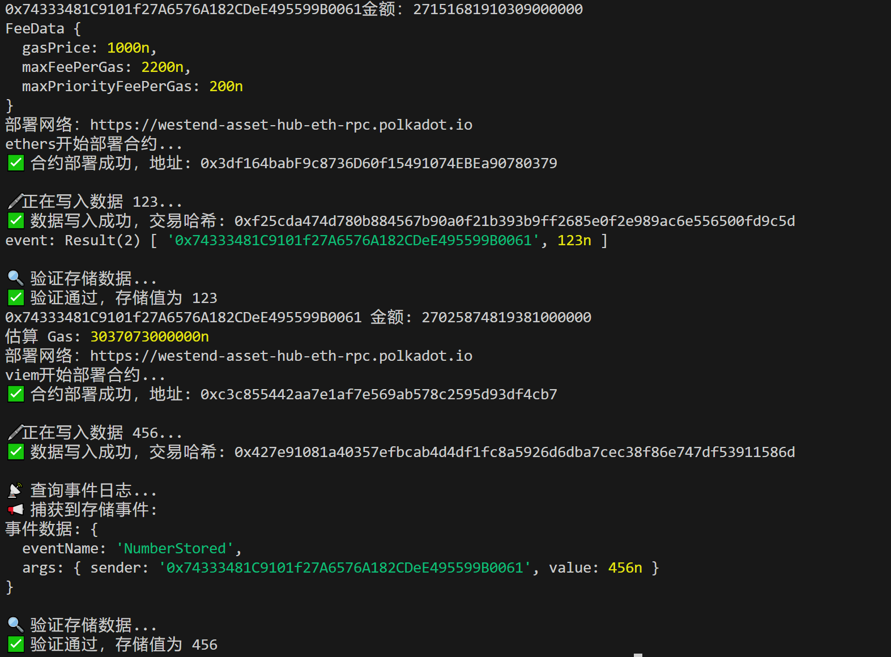
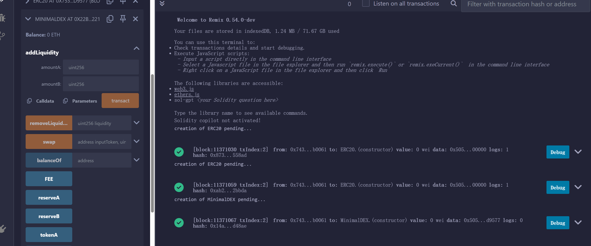
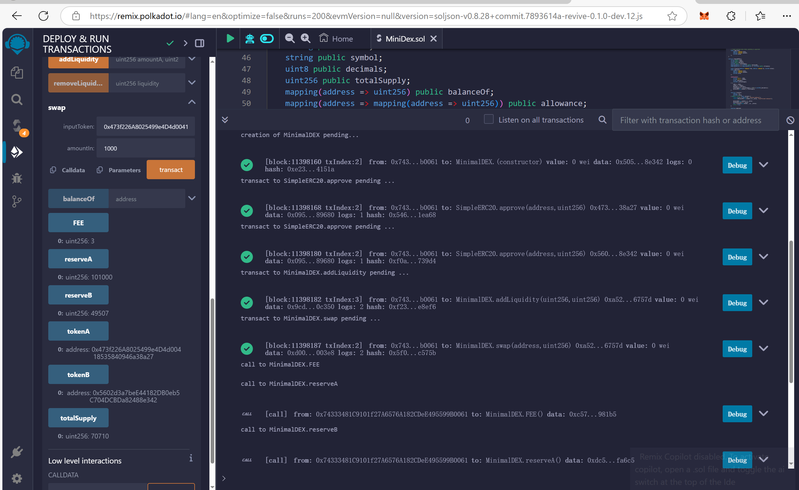
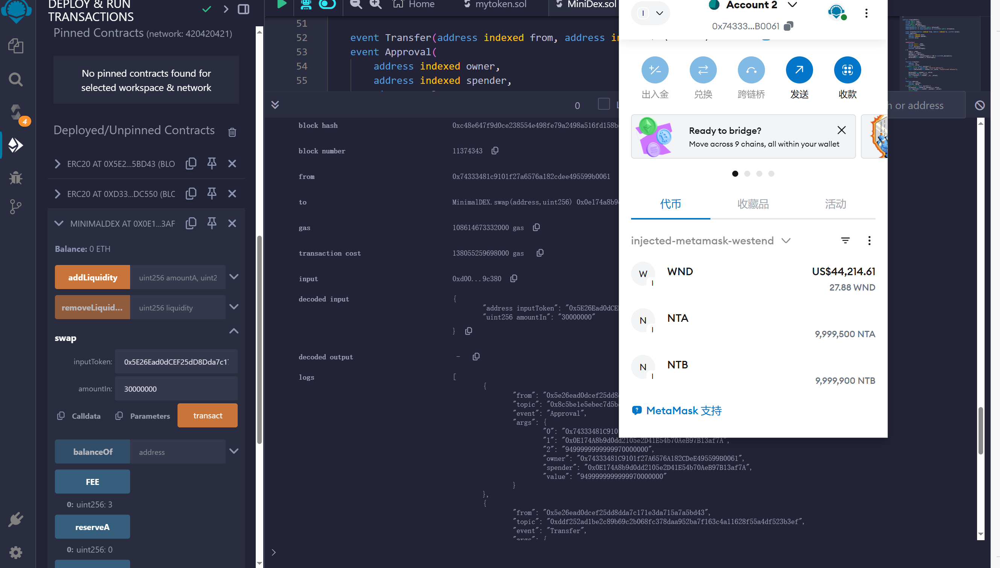
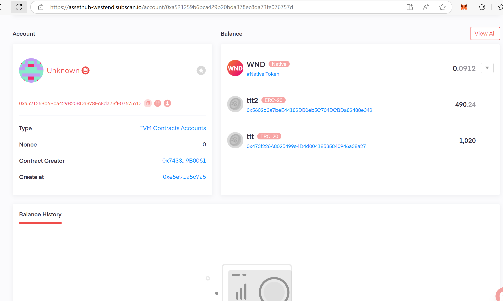
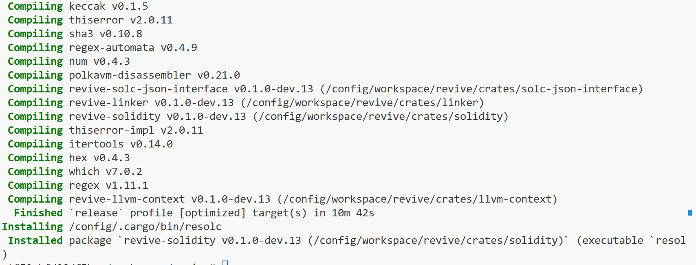
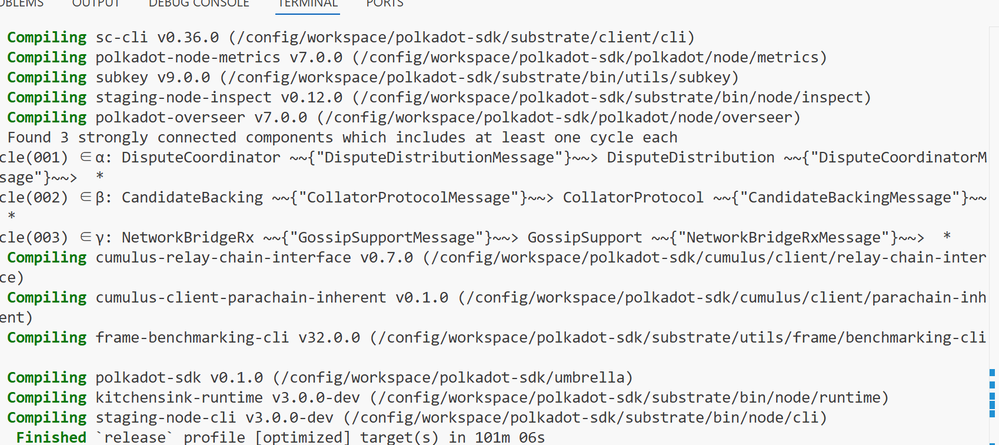
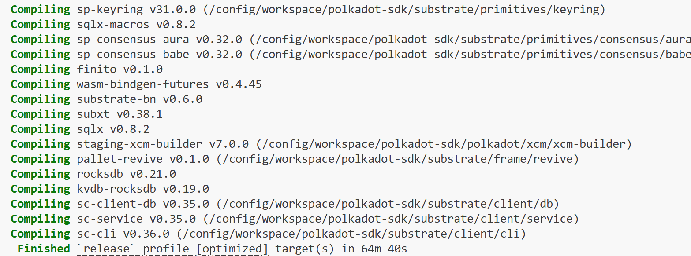
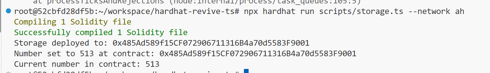
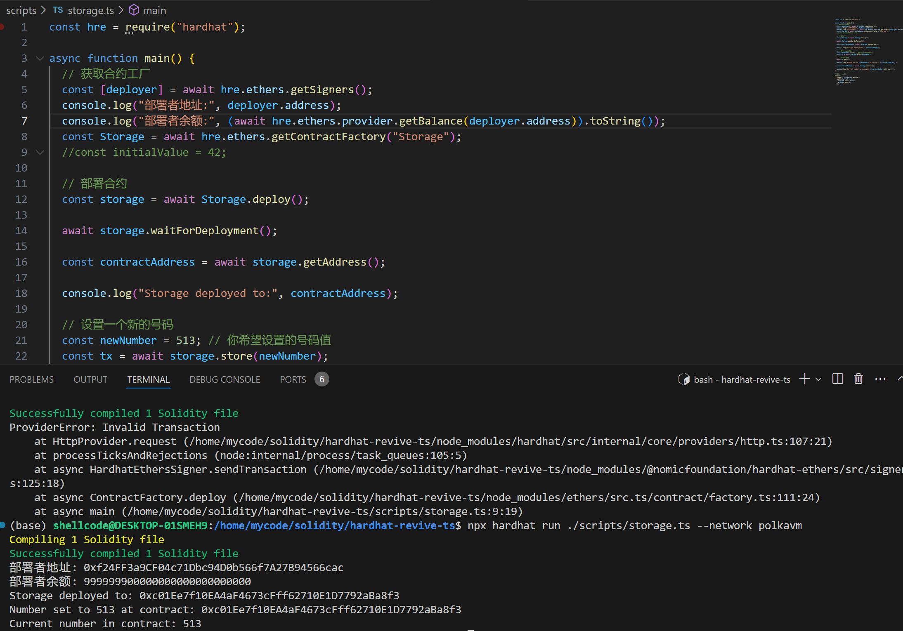

## task1

## task2
* 部署三个合约

* 完成授权，增加流动性交互

* 完成swap

* block浏览器呈现

## task3
* 编译resloc

* 编译polkadot-sdk(substrate-node与pallet-revive-eth-rpc)

* 编译合约，并部署上assethub-westend

* 编译合约，并部署上本地polkavm

