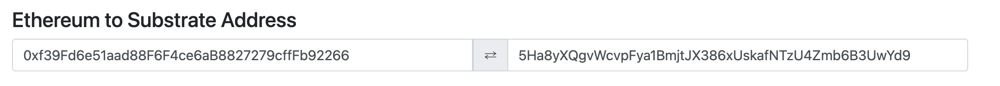

# Sample Hardhat Project

环境： macos M4-Max 64G

## 配置节点信息

编辑 `hardhat.config.ts` 文件，配置节点 `polkavm` 和 `ah` 信息。

## 启动substrate服务

参考文档
https://github.com/papermoonio/2025-17-solidity-on-polkadot/blob/main/homework-4/readme.md
在本地编译相关命令

```shell
# substrate-node
RUST_LOG="error,evm=debug,sc_rpc_server=info,runtime::revive=debug" target/release/substrate-node --dev --unsafe-rpc-external

# rpc
RUST_LOG="info,eth-rpc=debug" target/release/eth-rpc
```

## 设置环境变量

创建 `.env` 文件，配置 `RPC_URL` 和 `PRIVATE_KEY`

```shell
# polkavm 节点环境账户
LOCAL_PRIV_KEY=0x5fb92d6e98884f76de468fa3f6278f8807c48bebc13595d45af5bdc4da702133

# ah 节点环境账户（在本地利用 anvil 命令创建的账户密钥对，对应公钥是 0xf39Fd6e51aad88F6F4ce6aB8827279cffFb92266）
AH_PRIV_KEY=0xac0974bec39a17e36ba4a6b4d238ff944bacb478cbed5efcae784d7bf4f2ff80
```

## 合约测试

1. 安装依赖

```shell
npm install
```

2. 本地部署合约

使用 `hardhat.config.ts` 配置的本地节点 `polkavm`

#### 编译合约为 polkavm 格式

```shell
npx hardhat compile-revive --contract Storage.sol --show-stack-traces
```

#### 部署合约到 polkavm 节点

```shell
npx hardhat deploy-revive --contract Storage --network polkavm
```

3. 线上部署合约

对于 ah 节点，需要一个账户且账户需要有足够的钱。

#### 创建账户并充值

这里为了方便，利用anvil命令启动时，生成的一个账户，可以看到每个账户的
address和私钥，如这里使用的账户

```ini
account address：(0) 0xf39Fd6e51aad88F6F4ce6aB8827279cffFb92266 (10000.000000000000000000 ETH)

私钥：(0) 0xac0974bec39a17e36ba4a6b4d238ff944bacb478cbed5efcae784d7bf4f2ff80
```

但这个账户地址是以太坊格式，而我们需要在 substrate-node
节点时使用的base58格式的地址，因此需要将账户格式转换一下（https://www.shawntabrizi.com/substrate-js-utilities/），


#### 账户充值

打开 https://faucet.polkadot.io/westend 网址，为账户
`5Ha8yXQgvWcvpFya1BmjtJX386xUskafNTzU4Zmb6B3UwYd9` 领水。 领水交易详情
https://westend.subscan.io/extrinsic/0x6efc60625b090c22c4a865a2a27c5aa63994df892916434cf51433c3074b937f

#### 部署命令

```
npx hardhat deploy-revive --contract Storage --network ah
```

## 问题

1. 部署本节部署合约失败，报错信息如下：

```shell
(base) ➜  task3 git:(main) ✗ npx hardhat deploy-revive --contract Storage --network polkavm
Deploying with: 0xf24FF3a9CF04c71Dbc94D0b566f7A27B94566cac
Deployer balance: 999999900.0 ETH
Constructor Arguments: []
Deployment failed: AggregatedError: fields had validation errors
    at validateFields (/Users/sxf/workspace/2025-17-solidity-on-polkadot/homework-4/1648/task3/node_modules/micro-eth-signer/src/tx.ts:575:32)
    at new Transaction (/Users/sxf/workspace/2025-17-solidity-on-polkadot/homework-4/1648/task3/node_modules/micro-eth-signer/src/index.ts:114:19)
    at Function.prepare (/Users/sxf/workspace/2025-17-solidity-on-polkadot/homework-4/1648/task3/node_modules/micro-eth-signer/src/index.ts:140:12)
    at LocalAccountsProvider._getSignedTransaction (/Users/sxf/workspace/2025-17-solidity-on-polkadot/homework-4/1648/task3/node_modules/hardhat/src/internal/core/providers/accounts.ts:336:33)
    at processTicksAndRejections (node:internal/process/task_queues:105:5)
    at async LocalAccountsProvider.request (/Users/sxf/workspace/2025-17-solidity-on-polkadot/homework-4/1648/task3/node_modules/hardhat/src/internal/core/providers/accounts.ts:188:30)
    at async HardhatEthersSigner.sendTransaction (/Users/sxf/workspace/2025-17-solidity-on-polkadot/homework-4/1648/task3/node_modules/@nomicfoundation/hardhat-ethers/src/signers.ts:125:18)
    at async ContractFactory.deploy (/Users/sxf/workspace/2025-17-solidity-on-polkadot/homework-4/1648/task3/node_modules/ethers/src.ts/contract/factory.ts:111:24)
    at async SimpleTaskDefinition.action (/Users/sxf/workspace/2025-17-solidity-on-polkadot/homework-4/1648/task3/tasks/deploy-revive.ts:52:26)
    at async Environment._runTaskDefinition (/Users/sxf/workspace/2025-17-solidity-on-polkadot/homework-4/1648/task3/node_modules/hardhat/src/internal/core/runtime-environment.ts:351:14) {
  errors: [
    {
      field: 'gasLimit',
      error: 'must be >= 21000 and <= 30000000, not 13641554404240054'
    }
  ]
}
```

在 hardhat.config.ts 文件中，将 gasLimit 设置为 36451736500281453
仍然是一样的错误。 编辑 `tasks/deploy-revive.ts` 文件，部署合约时，指定 gasLimit
为 3_000_000n 仍是一样的错误。

2. 线上ah 节点部署合约失败，报错信息如下：

```shell
(base) ➜  task3 git:(main) ✗ npx hardhat deploy-revive --contract Storage --network ah
Deploying with: 0xf39Fd6e51aad88F6F4ce6aB8827279cffFb92266
Deployer balance: 0.069982602163 ETH
Constructor Arguments: []
Deployment failed: AggregatedError: fields had validation errors
    at validateFields (/Users/sxf/workspace/2025-17-solidity-on-polkadot/homework-4/1648/task3/node_modules/micro-eth-signer/src/tx.ts:575:32)
    at new Transaction (/Users/sxf/workspace/2025-17-solidity-on-polkadot/homework-4/1648/task3/node_modules/micro-eth-signer/src/index.ts:114:19)
    at Function.prepare (/Users/sxf/workspace/2025-17-solidity-on-polkadot/homework-4/1648/task3/node_modules/micro-eth-signer/src/index.ts:140:12)
    at LocalAccountsProvider._getSignedTransaction (/Users/sxf/workspace/2025-17-solidity-on-polkadot/homework-4/1648/task3/node_modules/hardhat/src/internal/core/providers/accounts.ts:336:33)
    at processTicksAndRejections (node:internal/process/task_queues:105:5)
    at async LocalAccountsProvider.request (/Users/sxf/workspace/2025-17-solidity-on-polkadot/homework-4/1648/task3/node_modules/hardhat/src/internal/core/providers/accounts.ts:188:30)
    at async HardhatEthersSigner.sendTransaction (/Users/sxf/workspace/2025-17-solidity-on-polkadot/homework-4/1648/task3/node_modules/@nomicfoundation/hardhat-ethers/src/signers.ts:125:18)
    at async ContractFactory.deploy (/Users/sxf/workspace/2025-17-solidity-on-polkadot/homework-4/1648/task3/node_modules/ethers/src.ts/contract/factory.ts:111:24)
    at async SimpleTaskDefinition.action (/Users/sxf/workspace/2025-17-solidity-on-polkadot/homework-4/1648/task3/tasks/deploy-revive.ts:52:26)
    at async Environment._runTaskDefinition (/Users/sxf/workspace/2025-17-solidity-on-polkadot/homework-4/1648/task3/node_modules/hardhat/src/internal/core/runtime-environment.ts:351:14) {
  errors: [
    {
      field: 'gasLimit',
      error: 'must be >= 21000 and <= 30000000, not 15419073240035'
    }
  ]
}
```

发现账户有 0.069982602163ETH, 领水后同样出现错误。

```shell
Deploying with: 0xf39Fd6e51aad88F6F4ce6aB8827279cffFb92266
Deployer balance: 10.066389602163 ETH
Constructor Arguments: []
Deployment failed: AggregatedError: fields had validation errors
    at validateFields (/Users/sxf/workspace/2025-17-solidity-on-polkadot/homework-4/1648/task3/node_modules/micro-eth-signer/src/tx.ts:575:32)
    at new Transaction (/Users/sxf/workspace/2025-17-solidity-on-polkadot/homework-4/1648/task3/node_modules/micro-eth-signer/src/index.ts:114:19)
    at Function.prepare (/Users/sxf/workspace/2025-17-solidity-on-polkadot/homework-4/1648/task3/node_modules/micro-eth-signer/src/index.ts:140:12)
    at LocalAccountsProvider._getSignedTransaction (/Users/sxf/workspace/2025-17-solidity-on-polkadot/homework-4/1648/task3/node_modules/hardhat/src/internal/core/providers/accounts.ts:336:33)
    at processTicksAndRejections (node:internal/process/task_queues:105:5)
    at async LocalAccountsProvider.request (/Users/sxf/workspace/2025-17-solidity-on-polkadot/homework-4/1648/task3/node_modules/hardhat/src/internal/core/providers/accounts.ts:188:30)
    at async HardhatEthersSigner.sendTransaction (/Users/sxf/workspace/2025-17-solidity-on-polkadot/homework-4/1648/task3/node_modules/@nomicfoundation/hardhat-ethers/src/signers.ts:125:18)
    at async ContractFactory.deploy (/Users/sxf/workspace/2025-17-solidity-on-polkadot/homework-4/1648/task3/node_modules/ethers/src.ts/contract/factory.ts:111:24)
    at async SimpleTaskDefinition.action (/Users/sxf/workspace/2025-17-solidity-on-polkadot/homework-4/1648/task3/tasks/deploy-revive.ts:52:26)
    at async Environment._runTaskDefinition (/Users/sxf/workspace/2025-17-solidity-on-polkadot/homework-4/1648/task3/node_modules/hardhat/src/internal/core/runtime-environment.ts:351:14) {
  errors: [
    {
      field: 'gasLimit',
      error: 'must be >= 21000 and <= 30000000, not 15419073240035'
    }
  ]
}
```

可以看到账户余额发生了变化 ，表示领取成功了。
