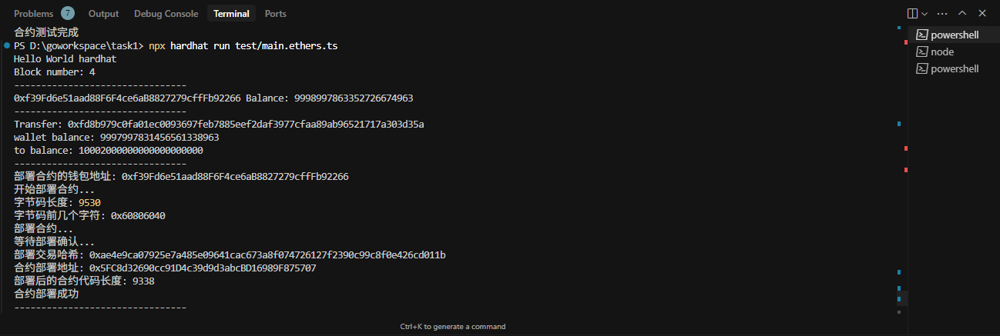
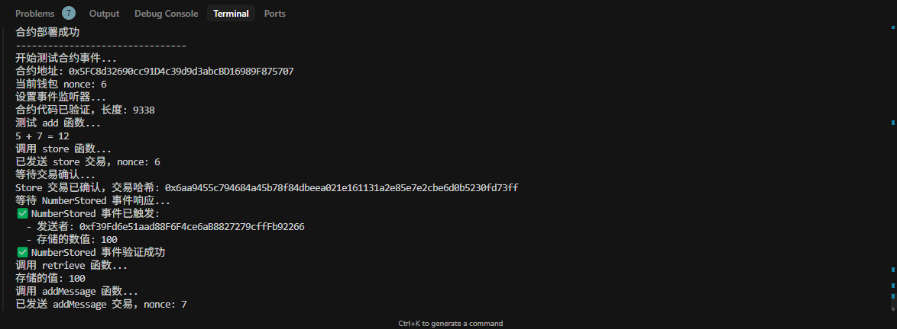
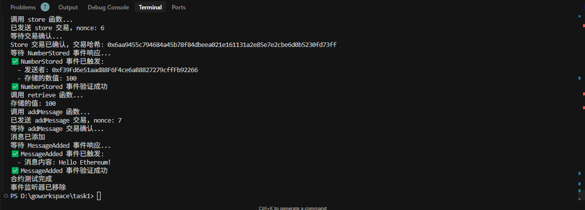
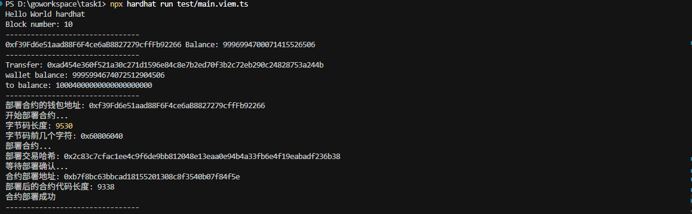
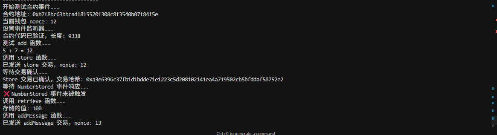
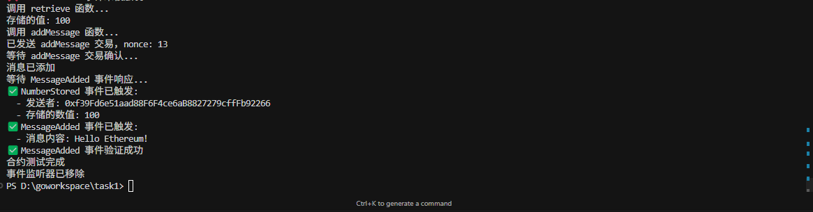

# Sample Hardhat Project

本项目展示了Hardhat的基本用法，包含一个样例合约、合约测试以及Hardhat Ignition模块用于部署合约。

## 基础命令

```shell
npx hardhat help
npx hardhat test
REPORT_GAS=true npx hardhat test
npx hardhat node
npx hardhat ignition deploy ./ignition/modules/Lock.ts
```

## 测试流程

本项目提供了使用ethers.js和viem两种方式与区块链交互的示例。测试流程如下：

### 1. 启动本地节点

首先，启动Hardhat本地节点：

```shell
npx hardhat node
```

### 2. 运行测试脚本

#### 使用ethers.js测试

```shell
npx ts-node test/main.ethers.ts
```

这将执行以下操作：
- 获取区块高度
- 查询账户余额
- 执行ETH转账
- 部署Storage合约
- 测试合约函数调用
- 测试合约事件监听





#### 使用viem测试

```shell
npx ts-node test/main.viem.ts
```

这将执行与ethers.js版本相同的操作，但使用viem库实现。





## 两种实现的比较

### ethers.js实现特点

- 使用Provider和Wallet模型
- 合约接口以TypeScript接口形式声明
- 事件监听通过contract.on实现

### viem实现特点

- 使用PublicClient和WalletClient分离读写操作
- 函数参数采用数组形式传递
- 事件监听通过watchContractEvent实现
- 更严格的类型检查

两种实现都完成了相同的功能，但API风格和类型系统有所不同。viem库提供了更现代化的API设计和更严格的类型安全性。
