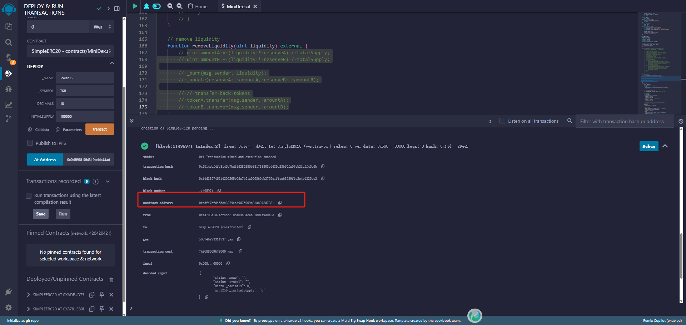

# MiniDex 部署和测试流程

## 环境准备

1. 访问 [Polkadot Remix IDE](https://remix.polkadot.io/)
2. 编译合约：
   - `MiniDex.sol`（包含 SimpleERC20 代币合约、交易合约MiniERC20）

## 部署步骤

### 1. 部署 ERC20 代币

1. 部署第一个 ERC20 代币 (TokenA)
   - 选择 `SimpleERC20.sol` 合约
   - 填写参数：
     - name: "Token A"
     - symbol: "TKNA"
     - decimals: 18
     - initialSupply: 10000
   - 点击部署按钮
   - 记录 TokenA 的合约地址：0xadf47bfd465ca3979ec49d76909c01ab972d7381
   部署成功截图：

2. 部署第二个 ERC20 代币 (TokenB)
   - 选择 `SimpleERC20.sol` 合约
   - 填写参数：
     - name: "Token B"
     - symbol: "TKNB"
     - decimals: 18
     - initialSupply: 10000
   - 点击部署按钮
   - 记录 TokenB 的合约地址：0x8780e8892fc43f54d75ebc786e57df8b173eb0b5
   部署成功截图：[部署成功截图](./pic/Token_B.png)

### 2. 部署 MinimalDex 合约

1. 选择 `MinimalDex.sol` 合约(注意：由于合约部署会由于文件过大导致部署失败，请务必注释掉部分代码目前只验证合约交互)
2. 填写构造函数参数：
   - _tokenA: [0xadf47bfd465ca3979ec49d76909c01ab972d7381]
   - _tokenB: [0x8780e8892fc43f54d75ebc786e57df8b173eb0b5]
3. 点击部署按钮
   - 记录 MinimalDex 的合约地址：0x074e98dcd9d40c4bfcabc734e4121a48d86cb530
   部署成功截图：[部署成功截图](./pic/Minimal.png)

## 功能测试

### 1. 授权 DEX 使用代币

1. 在 TokenA 合约界面：
   - 调用 `approve` 函数
   - 参数：
     - _spender: [0x074e98dcd9d40c4bfcabc734e4121a48d86cb530]
     - _value: 10000000000000000000000（授权 1000 个代币，含 18 位小数）
   - 点击执行
   授权成功截图：[授权成功截图](./pic/Token_A_approve.png)

2. 在 TokenB 合约界面：
   - 重复上述步骤，授权 MiniDex 使用 TokenB

### 2. 兑换代币

1. 兑换 TokenA 为 TokenB
   - 调用 `swap` 函数
   - 参数：
     - inputToken: [0xadf47bfd465ca3979ec49d76909c01ab972d7381]
     - amountIn: 100000000000000000000（10 个 TokenA，含 18 位小数）
   - 点击执行
   兑换成功截图：[兑换成功截图](./pic/swaft.png)
   - 检查返回的 `amountOut` 值
   - 验证 TokenB 余额是否增加

2. 兑换 TokenB 为 TokenA
   - 调用 `swap` 函数
   - 参数：
     - inputToken: [的合约地址：0x8780e8892fc43f54d75ebc786e57df8b173eb0b5]
     - amountIn: 100000000000000000000（10 个 TokenB，含 18 位小数）
   - 点击执行
   - 检查返回的 `amountOut` 值
   - 验证 TokenA 余额是否增加

