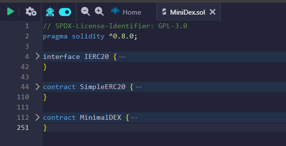
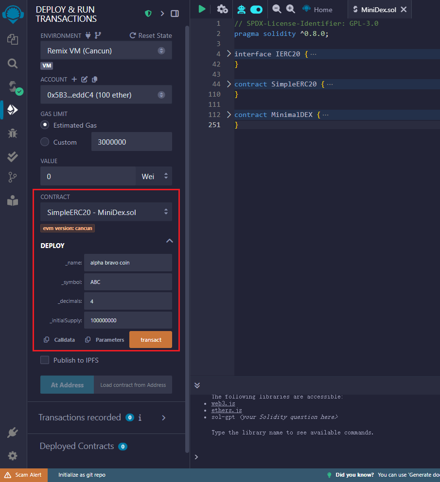
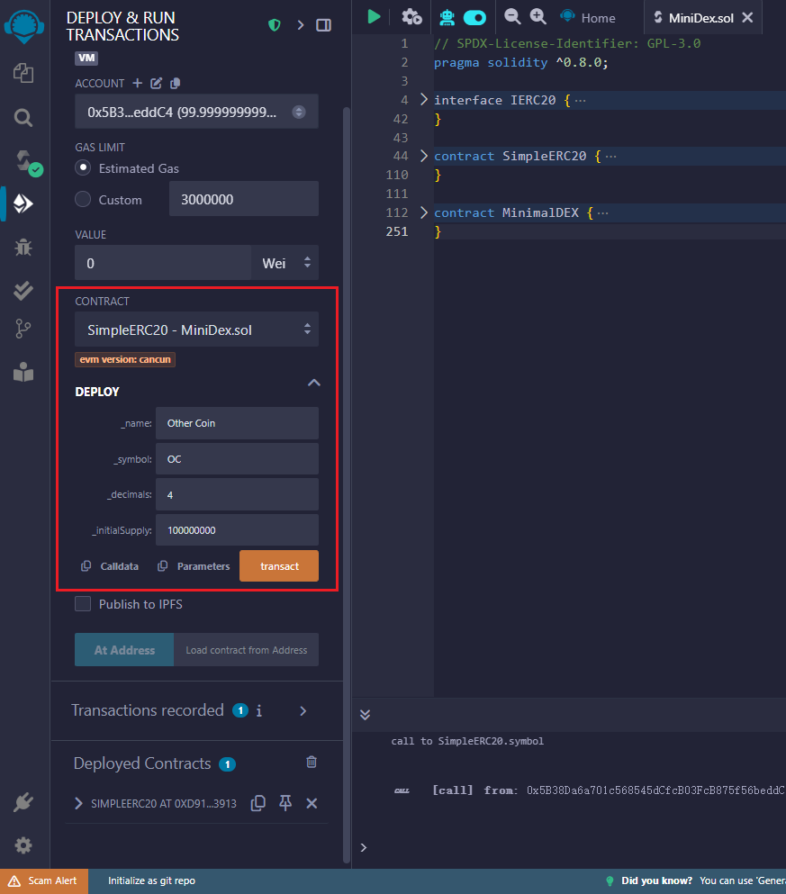
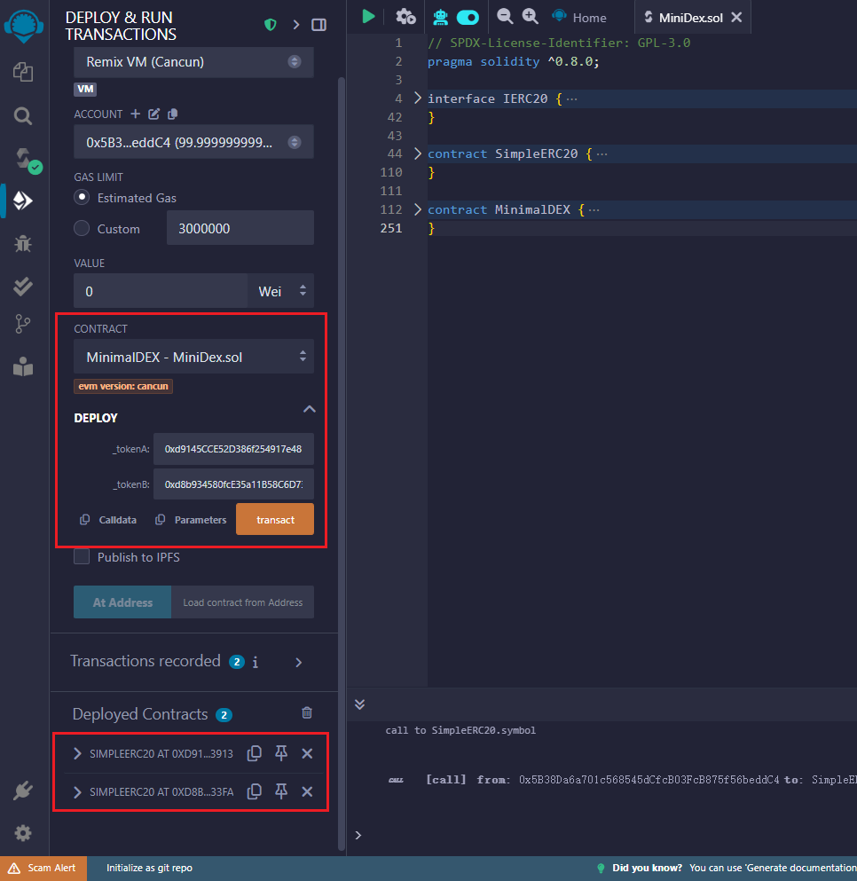
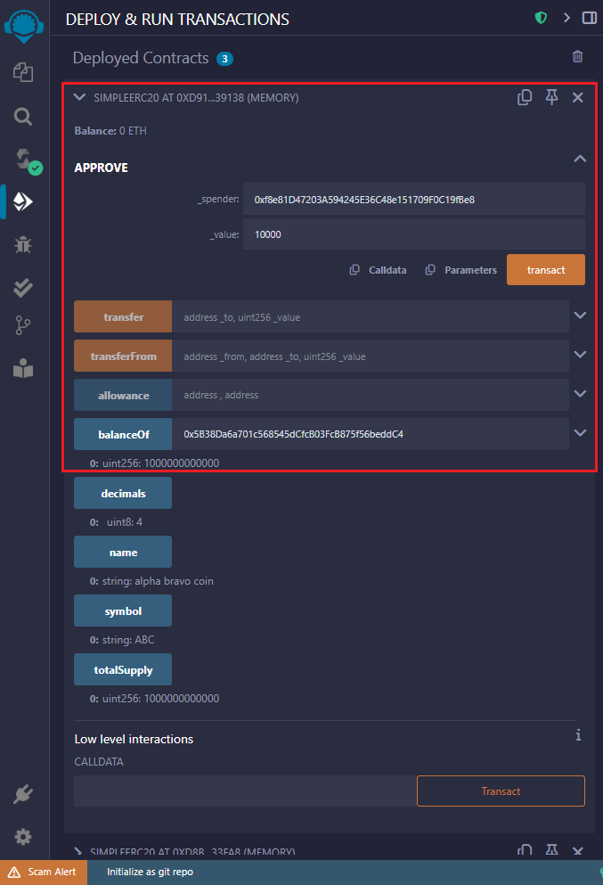
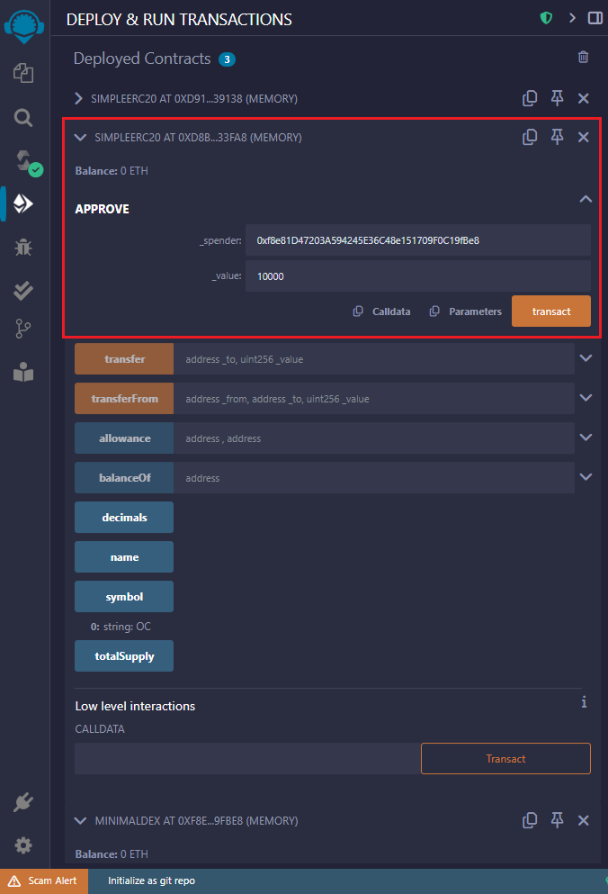
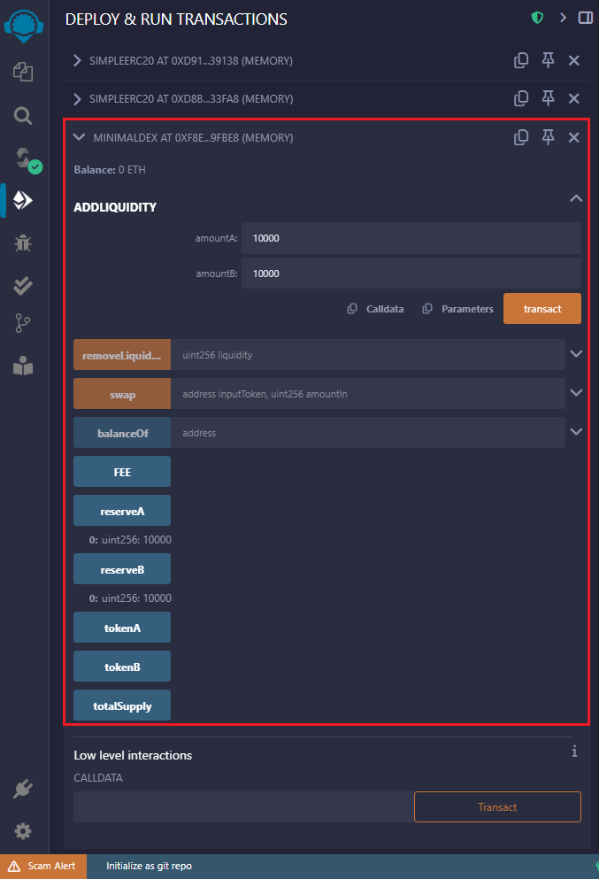
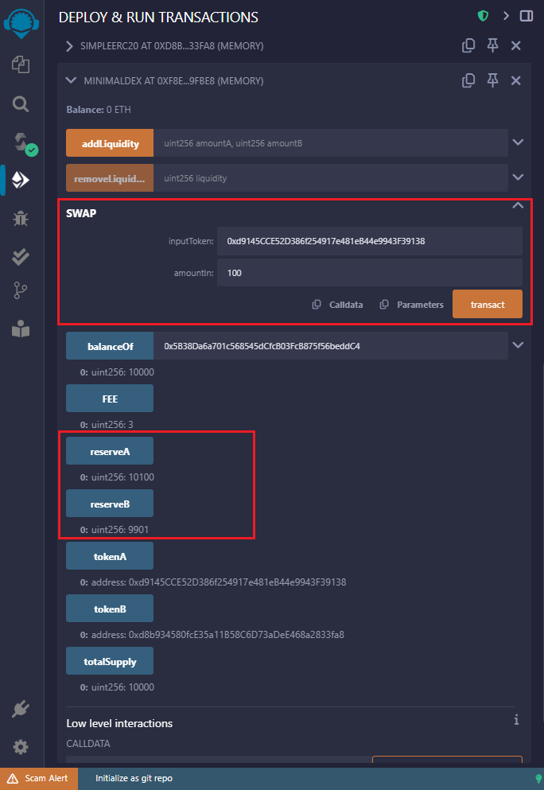
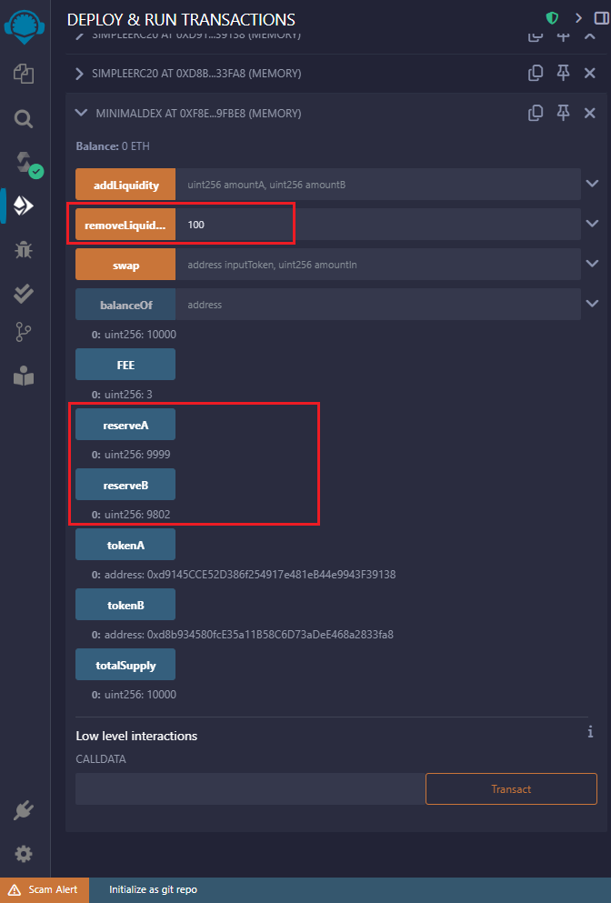

# 在 Remix 中部署和测试最小化 DEX

## 1. 准备环境并编译合约

1. 打开 [Remix IDE](https://remix.ethereum.org/)
2. 在左侧文件浏览器中创建新文件 `MiniDEX.sol`，复制粘贴准备好的代码，文件中包含 `SimpleERC20` 和 `MinimalDEX` 两个合约
3. 编译合约（点击左侧 Solidity 编译器图标，选择 0.8.0 或更高版本，然后点击"Compile"）

## 2. 部署和测试步骤

### 第一步：部署 ERC20 测试代币

先部署两个测试用的 ERC20 代币：
   - 切换到"Deploy & Run Transactions"标签
   - 选择 `SimpleERC20` 合约
   - 在构造函数参数中输入名称、符号、位数、初始供应量
   - 点击"Deploy"
   - 重复上述步骤部署一个不同的代码

### 第二步：部署 MinimalDEX

1. 在部署面板中选择 `MinimalDEX` 合约
2. 在构造函数参数中输入刚才部署的两个 `SimpleERC20` 合约地址
3. 点击"Deploy"

### 第三步：测试 DEX 功能

### 测试1：添加流动性
1. 在第一个ERC20代币合约界面，调用`approve`方法：
   - `_spender`: MinimalDEX合约地址
   - `_value`: 10000 (或其他数量)

2. 在第二个ERC20代币合约界面，同样调用`approve`方法

3. 在MinimalDEX合约界面，调用`addLiquidity`方法：
   - `amountA`: 10000
   - `amountB`: 10000
   
4. 检查`reserveA`和`reserveB`是否更新为1000000

### 测试2：交换代币
1. 在第一个ERC20代币合约界面，再次调用`approve`方法授权DEX合约使用你的代币
2. 在MinimalDEX合约界面，调用`swap`方法：
   - `inputToken`: TokenA的合约地址
   - `amountIn`: 100
3. 检查你是否收到了TokenB，并且储备量已相应更新

### 测试3：移除流动性
1. 在MinimalDEX合约界面，调用`removeLiquidity`方法：
   - `liquidity`: 你拥有的流动性数量的一部分(可通过`balanceOf`查看)
2. 检查你是否收到了相应比例的TokenA和TokenB

## 3. 验证功能

1. 检查`reserveA`和`reserveB`在每次操作后是否正确更新
2. 验证交换比率是否符合恒定乘积公式(x * y = k)
3. 确认流动性提供者可以按比例提取资金

## 注意事项

1. 确保在每次转账前调用`approve`授权DEX合约使用你的代币
2. 添加流动性时，初始比率会影响后续交换比率
3. 测试小额交易后再进行大额交易
4. 可以在Remix的控制台查看交易详情和事件日志
