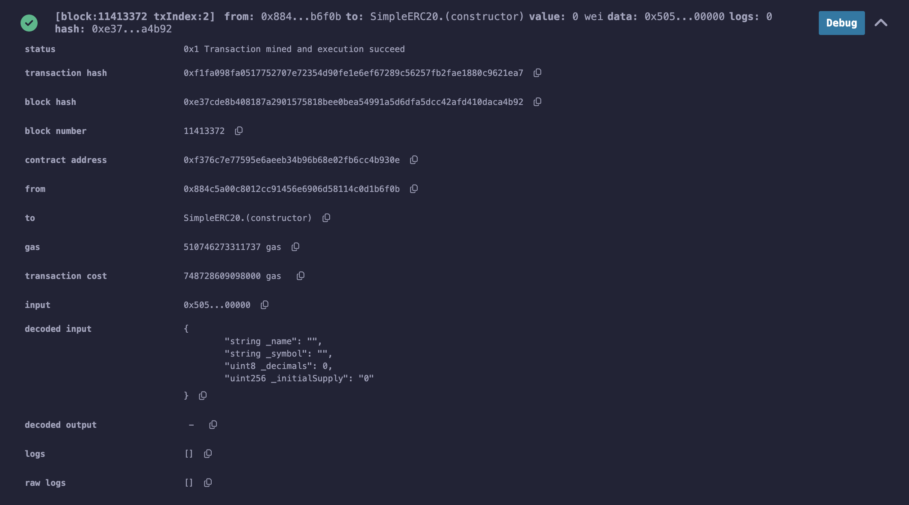
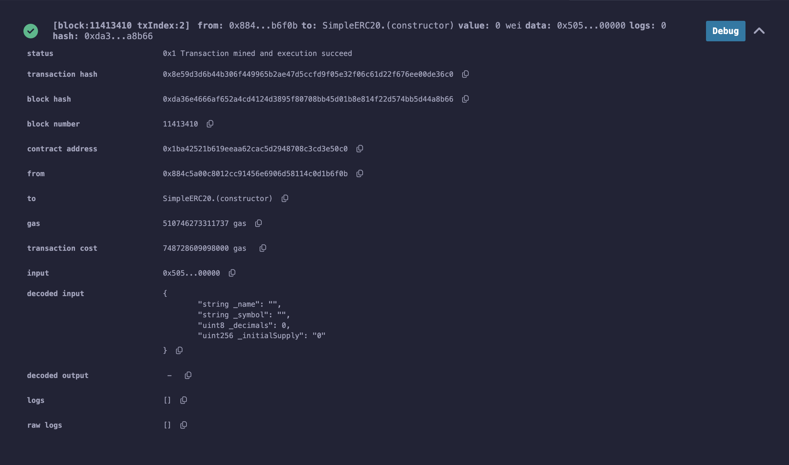

# Steps

## Deploy the ERC20 Tokens

**tokenA** address: 0xF376c7E77595E6AEeb34B96b68e02fb6cc4b930E

**tokenB** address: 0x1Ba42521B619Eeaa62CAC5d2948708c3cD3e50c0

## Deploy the MiniDEX

TODO

Deploy in remix has some issues, waiting for the fix.
