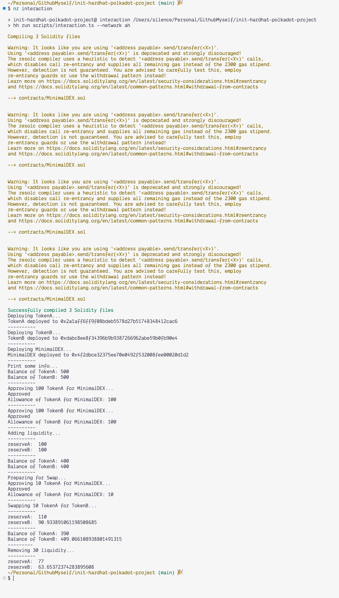

# Steps

## Deploy the ERC20 Tokens

**tokenA** address: [0x2a1aff6ff9f08bdeb5578d27b51748348412cac6](https://blockscout-asset-hub.parity-chains-scw.parity.io/address/0x2a1aff6ff9f08bdeb5578d27b51748348412cac6?tab=txs)

**tokenB** address: [0xdabc8ee8f34396b9b9387266962abe59b0fb90e4](https://blockscout-asset-hub.parity-chains-scw.parity.io/address/0xdabc8ee8f34396b9b9387266962abe59b0fb90e4?tab=txs)

## Deploy the MiniDEX

**MiniDEX** address: [0x4f2dbce32375ee70e0492f532008fee00020d1d2](https://blockscout-asset-hub.parity-chains-scw.parity.io/address/0x4f2dbce32375ee70e0492f532008fee00020d1d2?tab=txs)

## Interaction of the MinimalDEX

